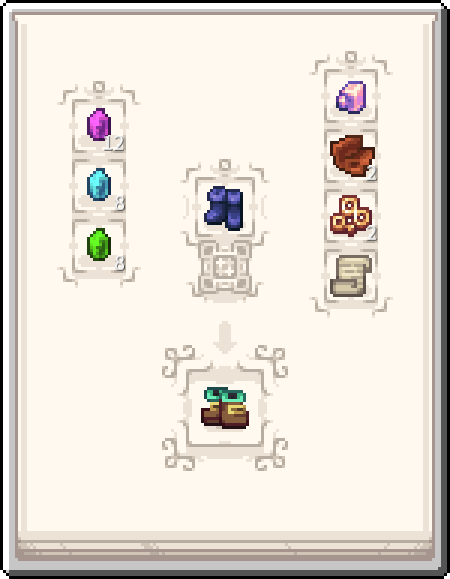

---
navigation:
 title: Boots of the traveller
 icon: kubejs:boots_of_the_traveller
 parent: magic_rituals/index.md
item_ids:
 - kubejs:boots_of_the_traveller
---

# Boots of the traveller

<Row>
<ItemImage id="kubejs:boots_of_the_traveller" scale="4" />
</Row>

# <Color id="blue">What is boots of the traveller?</Color>
<ItemLink id="kubejs:boots_of_the_traveller" /> are an old model of boots made by an old wizard who gave them as a gift to a nomadic friend.

The wizard in question liked the boots so much that he wrote down the recipe in the aura of the overworld.

- The <ItemLink id="kubejs:boots_of_the_traveller" /> gives a speed effect when equipped

# <Color id="blue">How can they be obtained?</Color>

# <Color id="blue">What are they for?</Color>
Gives speed to player when equipped
