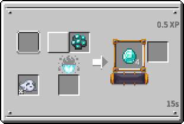

---
navigation:
  title: Native Clusters
  icon: kubejs:native_diamond_cluster
  parent: magic_rituals/index.md
item_ids:
  - kubejs:native_copper_cluster
  - kubejs:native_iron_cluster
  - kubejs:native_gold_cluster
  - kubejs:native_tin_cluster
  - kubejs:native_nickel_cluster
  - kubejs:native_lead_cluster
  - kubejs:native_silver_cluster
  - kubejs:native_zinc_cluster
  - kubejs:native_redstone_cluster
  - kubejs:native_diamond_cluster
  - kubejs:native_cinnabar_cluster
---

# Native Clusters

<Row>
  <ItemImage id="kubejs:native_diamond_cluster" scale="4" />
</Row>

# <Color id="blue">What is the native cluster?</Color>
Native Clusters are a purified form of the raw materials of an ore.

# <Color id="blue">How can they be obtained?</Color>
Native clusters are a byproduct of ore blocks when broken with an <ItemLink id="kubejs:elder_miners_pickaxe" />

* the chance to get a cluster is 30% 

<Color id="green">⚠ Note</Color>: Native cluster drops do not cancel out raw material drops. Cluster drops works as a bonus item.

# <Color id="blue">What ores have native clusters?</Color>

| Ores                                   |
| -------------------------------------- |
| <ItemLink id="minecraft:raw_copper" /> |
| <ItemLink id="minecraft:raw_iron" />   |
| <ItemLink id="minecraft:raw_gold" />   |
| <ItemLink id="thermal:raw_tin" />      |
| <ItemLink id="thermal:raw_nickel" />   |
| <ItemLink id="thermal:raw_lead" />     |
| <ItemLink id="thermal:raw_silver" />   |
| <ItemLink id="create:raw_zinc" />      |
| <ItemLink id="minecraft:diamond" />    |
| <ItemLink id="minecraft:redstone" />   |
| <ItemLink id="thermal:cinnabar" />     |

# <Color id="blue">What are they for?</Color>
Clusters yield 4 ingots when smelted in a soul fire clibano.

