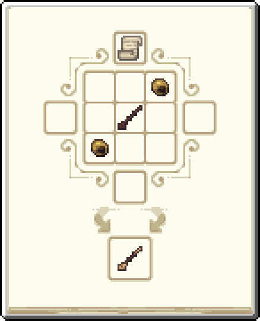
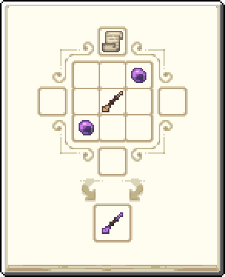

---
navigation:
 title: Wands
 icon: kubejs:runewood_wand
 parent: magic_rituals/index.md
item_ids:
 - kubejs:runewood_wand
 - kubejs:brass_wand
 - kubejs:soul_stained_steel_wand
---

# Wands

<Row>
<ItemImage id="kubejs:runewood_wand" scale="4" />
</Row>

# <Color id="blue">What is wands?</Color>

Wands are catalysts for malum spirits, they are very important items within the modpack, with them you can collect spirits from nodes by pressing <Color id="yellow">right-click</Color> directly, each tier of wands has a cooldown.

- Wands are used to replicate researches in a <Color id="blue">research table</Color>, if the wand is present in the table, only duplication recipes can be made
- Wands are used to make spirit catalysts work

# <Color id="blue">Wand Types</Color>

## Runewood
The <ItemLink id="kubejs:runewood_wand" /> is the most basic and starting wand of the modpack.

- Cooldown to interact with node: 60s
- Durability: 150

## Brass
The <ItemLink id="kubejs:brass_wand" /> is an upgrade to the runewood wand, it has greater durability and a shorter cooldown.

- Cooldown to interact with node: 45s
- Durability: 300

## Soul Stained Steel
The <ItemLink id="kubejs:soul_stained_steel_wand" /> is an upgrade to the brass wand, it has greater durability and a shorter cooldown.

- Cooldown to interact with node: 30s
- Durability: 700

# <Color id="blue">How can they be obtained?</Color>

## Runewood Wand
- <Color id="yellow">Right-click</Color> with an <ItemLink id="malum:totemic_staff" /> on a <ItemLink id="malum:exposed_runewood_log" />

## Brass Wand

- Note: Uses <ItemLink id="kubejs:brass_wand_research_page" />

## Soul Stained Steel Wand

- Note: Uses <ItemLink id="kubejs:magic_mirror_research_page" />