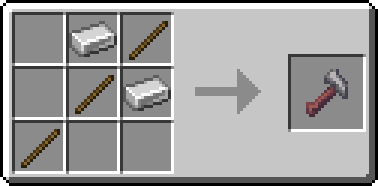
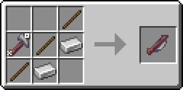
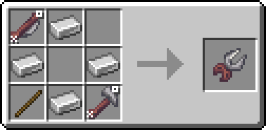
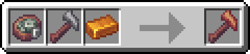
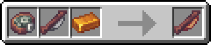
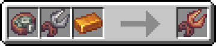
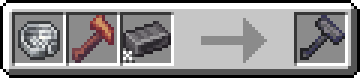
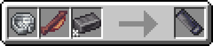
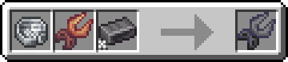

---
navigation:
  title: Crafting Tools
  icon: kubejs:basic_hammer
  parent: techlab/index.md
item_ids:
  - kubejs:primitive_hammer
  - kubejs:primitive_saw
  - kubejs:primitive_wirecutter
  - kubejs:rustic_hammer
  - kubejs:rustic_saw
  - kubejs:rustic_wirecutter
  - kubejs:basic_hammer
  - kubejs:basic_saw
  - kubejs:basic_wirecutter
---

<Row>
  <ItemImage id="minecraft:smithing_table" scale="4" />
</Row>

# Crafting Tools

# <Color id="blue">What is Crafting Tools?</Color>

The crafting are used to craft contraptions in early stage of the pack. They has a durability that is spent on crafts (The cost is variable) and upgrading tool-tier they incrase their durability.

* Even low-level tools can be used in all crafts.

* Later you change this tools by other machines

# <Color id="blue">Tools Tiers</Color>

The tools are divided into tiers, as the tier is higher, the durability increases, the tiers are listed below

## <Color id="blue">Primitive Tools</Color>

Primitive Tools are the most basic tools in TechPack, they are used to craft some contraptions and itens.

<Row>
  <ItemImage id="kubejs:primitive_saw" scale="2" />
  <ItemImage id="kubejs:primitive_hammer" scale="2" />
  <ItemImage id="kubejs:primitive_wirecutter" scale="2" />
</Row>

## <Color id="blue">Rustic Tools</Color>

Rustic Tools are the medium tier tools in TechPack. They are obtained at begginig of [Chapter II] when you can make your fists bronze ingots.

* They incrase the durability in <Color id="blue">184</Color> points compared with all primitive tools

<Row>
  <ItemImage id="kubejs:rustic_saw" scale="2" />
  <ItemImage id="kubejs:rustic_hammer" scale="2" />
  <ItemImage id="kubejs:rustic_wirecutter" scale="2" />
</Row>

## <Color id="blue">Basic Tools</Color>

Basic Tools are the most advanced tools in TechPack (at the moment). They are obtained at endinig of [Chapter II] when you can make your fists steel ingots.

* They incrase the durability in <Color id="blue">388</Color> points compared with all rustic tools and <Color id="blue">572</Color> points compared with all basic tools

<Row>
  <ItemImage id="kubejs:basic_saw" scale="2" />
  <ItemImage id="kubejs:basic_hammer" scale="2" />
  <ItemImage id="kubejs:basic_wirecutter" scale="2" />
</Row>

