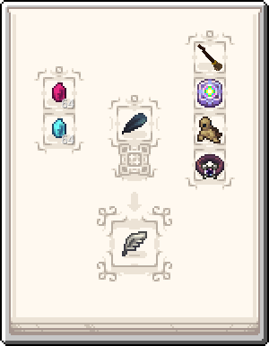

---
navigation:
  title: Flying Methods
  icon: magicfeather:magic_feather
  parent: techlab/index.md
item_ids:
  - magicfeather:magic_feather
  - angelring:angel_ring
  - angelring:energetic_angel_ring
  - angelring:leadstone_angel_ring
  - angelring:hardened_angel_ring
  - angelring:reinforced_angel_ring
  - angelring:resonant_angel_ring
---
# Flying Methods

<Row>
  <ItemImage id="magicfeather:magic_feather" scale="4" />
</Row>

# <Color id="blue">What are the methods of flying??</Color>

Lorem ipsum dolor sit amet, consectetur adipiscing elit. Etiam eget ligula eu lectus lobortis condimentum. Aliquam nonummy auctor massa. Pellentesque habitant morbi tristique senectus et netus et malesuada fames ac turpis egestas. Nulla at risus. Quisque purus magna, auctor et, sagittis ac, posuere eu, lectus. Nam mattis, felis ut adipiscing

# <Color id="blue">Craft</Color>

