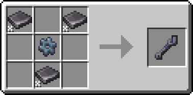

---
navigation:
  title: Wrench
  icon: kubejs:wrench
  parent: techlab/index.md
item_ids:
  - kubejs:wrench
---
# Wrench

<Row>
  <ItemImage id="kubejs:wrench" scale="4" />
</Row>

# <Color id="blue">What is a wrench?</Color>

wrench is an item that can rotate blocks or pick them up without having to break them

* to rotate blocks, <Color id="yellow">Right-Click</Color> using the <ItemLink id="kubejs:wrench" />
* to pick up blocks, <Color id="yellow">Shift-Right-Click</Color> using <ItemLink id="kubejs:wrench" />

# <Color id="blue">Craft</Color>

# <Color id="blue">Blocks that interact with the wrench</Color>

To know which items can interact with the <ItemLink id="kubejs:wrench" /> you can read the page below:
* [Wrench can interact](wrench_interact.md)