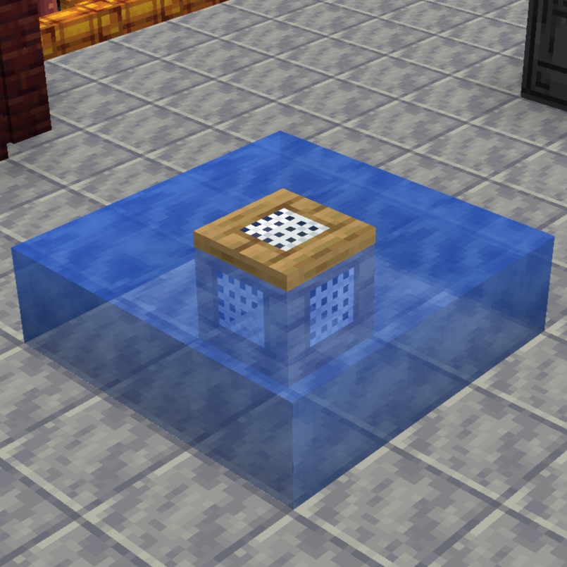

---
navigation:
  title: Fishing Basin
  icon: custommachinery:custom_machine_item
  icon_nbt: '{machine:"custommachinery:industrialrevival/fishing_basin"}'
  parent: techlab_machines/index.md
---

# Fishing Basin

<GameScene zoom="3">
  <ImportStructure src="../game_scenes/fishing_basin.nbt" />
</GameScene>

## <Color id="blue">What is the Fishing Basin?</Color>

Fishing Basin is a machine added by Techlab Machines. The Fishing Basin requires a fishing net to works.

can fish some items when placed around water like in the structure below

items that can be fished using <ItemLink id="kubejs:primitive_fishing_net" />:

* <ItemLink id="minecraft:moss_block" />
* <ItemLink id="minecraft:bone" />
* <ItemLink id="minecraft:kelp" />
* <ItemLink id="minecraft:clay_ball" />
* <ItemLink id="minecraft:ink_sac" />
* <ItemLink id="minecraft:cod" />
* <ItemLink id="minecraft:salmon" />
* <ItemLink id="upgrade_aquatic:pike" />
* <ItemLink id="minecraft:pufferfish" />

## <Color id="blue">Import and Export Config</Color>

You can configure it by clicking the button with the gear icon (located below the upgrade slot).

Once pressed, it will add a colored square above the machine's elements. By clicking on an element, you can configure which face can be set to input, output, or both:

* <Color id="red">Red = Import</Color>
* <Color id="blue"> Blue = Export </Color>
* <Color id="light_purple"> Purple = Both </Color>

The rectangular buttons below indicate whether auto-import/export is enabled (Auto-import/export is a function that automatically pulls or pushes items, fluids, and energy without the need for external mechanisms).

## <Color id="blue">Supported Modifiers:</Color>

Modifiers are added to the slot above the configuration button.

* <ItemLink id="kubejs:energy_modifier" /> <Color id="blue">decreases</Color> the amount of energy needed to process a recipe
* <ItemLink id="kubejs:speed_modifier" /> <Color id="blue">increases</Color> the processing speed of a recipe

## <Color id="blue">Tier Upgrade</Color>

Machines have tiers like Mekanism or Gregtech

Basic > Advanced > Turbo 

Tier Changes:
* Increase Energy Storage
* Increase Processing Speed 
* Exclusive Tier Recipes 

<Color id="green">⚠ Tip:</Color>For recipes that require specific tiers, information is added to the JEI/EMI
