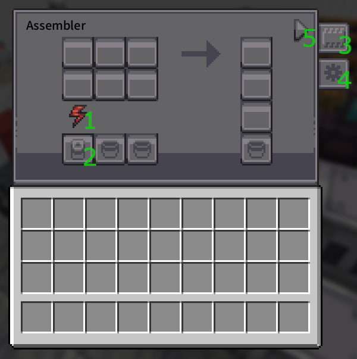

# Techlab Machines

<GameScene zoom="3">
  <ImportStructure src="../game_scenes/techlab_machines.nbt" />
</GameScene>

# <Color id="blue">What is techlab machines?</Color>

Techlab is a local library made for Techpack and also have machines, the machine has unique features among them.

# <Color id="blue">Machines</Color>

All the machines added by Techlab:

<SubPages />

# <Color id="blue">Tier Upgrades</Color>

Machines have tiers like Mekanism or Gregtech

<Color id="blue">Basic > Advanced > Turbo</Color>

Tier Changes:
* Increase Energy Storage
* Increase Processing Speed
* Exclusive Tier Recipes

<Color id="green">⚠ Tip:</Color>For recipes that require specific tiers, information is added to the JEI/EMI

# <Color id="blue">Patterns between machines</Color>

techpack machines have certain notable patterns, they are

UI Exemple:

## Energy Bar

<Color id="green">1.</Color> For machines that require or produce energy there is a bar that indicates energy storage

## Energy I/O Slot

<Color id="green">2.</Color> Electric machines or generators have a slot with a battery icon that is used to insert or extract energy

## Modifier Slot

<Color id="green">3.</Color> Electric machines or generators have a slot with a chip icon that is used to add modifiers

Modifier Effects:

## I/O Config Button

<Color id="green">4.</Color> Input and Output configuration button.

You can configure it by clicking the button with the gear icon (located below the upgrade slot).

Once pressed, it will add a colored square above the machine's elements. By clicking on an element, you can configure which face can be set to input, output, or both:

* <Color id="red">Red = Import</Color>
* <Color id="blue"> Blue = Export </Color>
* <Color id="light_purple"> Purple = Both </Color>

The rectangular buttons below indicate whether auto-import/export is enabled (Auto-import/export is a function that automatically pulls or pushes items, fluids, and energy without the need for external mechanisms).

## Recipe Status

<Color id="green">5.</Color> Indicates the status of the machine, idle, running or error.

* Idle: waiting for a recipe
* Running: processing a recipe
* Error: error due to lack of power or manual disabling