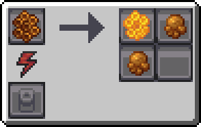

---
navigation:
  icon: techpack:boreal_bee_queen
  title: Boreal Bee
  parent: beekeeping/index.md
  position: 2
categories:
  - bee_species
  - require/catching_net
item_ids:
  - techpack:boreal_bee_drone
  - techpack:boreal_bee_queen
  - techpack:sticky_comb
  - techpack:wild_boreal_nest
---
<Row>
<ItemImage id="techpack:boreal_bee_queen"/>

# <Color id="blue">Boreal Bees</Color>
</Row>
Bees that commonly live in taiga forests, because they live close to resin-producing trees, their honeycombs acquire sticky characteristics. Strangely, they have the ability to turn <ItemLink id="minecraft:sweet_berries"/> into compounds very similar to <ItemLink id="nomansland:resin"/>.

## <Color id="yellow">General Stats</Color>
- **Method of obtaining**: Collecting <ItemLink id="techpack:wild_boreal_nest"/> (Found in taigas) with <ItemLink id="techpack:catching_net"/>
- **Drone/Queen Health Points**: 10/30
- **Pollinate Blocks**: <ItemLink id="minecraft:sweet_berries"/>
- **Activity Period**: _Daytime_

## <Color id="yellow">Bee House Stats</Color>
- **Breeding Time:** _60s_

## <Color id="yellow">Apiary Stats</Color>
- **Produces**: <ItemLink id="techpack:sticky_comb"/>
- **Production Time:** _30s_

---

<Row>
<ItemImage id="techpack:sticky_comb"/>

# <Color id="blue">Sticky Comb</Color>
</Row>
A hexagonal honeycomb with resinous characteristics, making it stickier.

## <Color id="yellow">Uses</Color>
When placed in an <ItemLink id="techpack:basic_centrifuge"/>, it generates products and sub-products.

