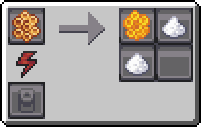

---
navigation:
  icon: techpack:common_bee_queen
  title: Common Bee
  parent: beekeeping/index.md
  position: 1
categories:
  - bee_species
  - require/catching_net
item_ids:
  - techpack:common_bee_drone
  - techpack:common_bee_queen
  - techpack:sweet_comb
  - techpack:wild_forest_nest
---
<Row>
<ItemImage id="techpack:common_bee_queen"/>

# <Color id="blue">Common Bees</Color>
</Row>
Common bees, very common in temperate forests. These bees produce an incredibly sweet honeycomb when placed in apiaries. They are the species that pollinates the most on the planet.

## <Color id="yellow">General Stats</Color>
- **Method of obtaining**: Collecting <ItemLink id="techpack:wild_forest_nest"/> (Found in forests) with <ItemLink id="techpack:catching_net"/>
- **Drone/Queen Health Points**: 10/30
- **Pollinate Blocks**: Any Flower
- **Activity Period**: _Daytime_

## <Color id="yellow">Bee House Stats</Color>
- **Breeding Time:** _60s_

## <Color id="yellow">Apiary Stats</Color>
- **Produces**: <ItemLink id="techpack:sweet_comb"/>
- **Production Time:** _30s_

---

<Row>
<ItemImage id="techpack:sweet_comb"/>

# <Color id="blue">Sweet Comb</Color>
</Row>
A hexagonal honeycomb with a strangely sweet taste.

## <Color id="yellow">Uses</Color>
When placed in an <ItemLink id="techpack:basic_centrifuge"/>, it generates products and sub-products.

