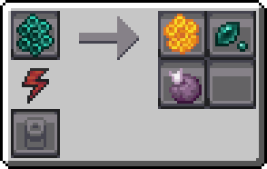

---
navigation:
  icon: techpack:enigmatic_bee_queen
  title: Enigmatic Bee
  parent: beekeeping/index.md
  position: 4
categories:
  - bee_species
  - require/catching_net
item_ids:
  - techpack:enigmatic_bee_drone
  - techpack:enigmatic_bee_queen
  - techpack:oscillanting_comb
  - techpack:wild_chorus_nest
---
<Row>
<ItemImage id="techpack:enigmatic_bee_queen"/>

# <Color id="blue">Enigmatic Bees</Color>
</Row>
The presence of beings like bees in such a dystopian place as The End is very strange; however, even with adversity, bees managed to adapt to the location and began pollinating <ItemLink id="enderscape:chorus_sprouts"/>, a diet that made them similar to Endermen. Their honeycombs, influenced by their diet, possess teleportation characteristics, being able to form <ItemLink id="minecraft:ender_pearl"/> or <ItemLink id="minecraft:chorus_fruit"/>...

## <Color id="yellow">General Stats</Color>
- **Method of obtaining**: Collecting <ItemLink id="techpack:wild_chorus_nest"/> (Found in end) with <ItemLink id="techpack:catching_net"/>
- **Drone/Queen Health Points**: 10/20
- **Pollinate Blocks**: <ItemLink id="enderscape:chorus_sprouts"/>
- **Activity Period**: _Daytime and Nighttime_

## <Color id="yellow">Bee House Stats</Color>
- **Breeding Time:** _240s_

## <Color id="yellow">Apiary Stats</Color>
- **Produces**: <ItemLink id="techpack:oscillanting_comb"/>
- **Production Time:** _120s_

---

<Row>
<ItemImage id="techpack:oscillanting_comb"/>

# <Color id="blue">Oscillanting Comb</Color>
</Row>
A hexagonal honeycomb with teleportation characteristics similar to <ItemLink id="minecraft:ender_pearl"/> or <ItemLink id="minecraft:chorus_fruit"/>

## <Color id="yellow">Uses</Color>
When placed in an <ItemLink id="techpack:basic_centrifuge"/>, it generates products and sub-products.

