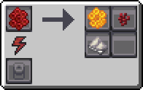

---
navigation:
  icon: techpack:fossil_bee_queen
  title: Fossil Bee
  parent: beekeeping/index.md
  position: 3
categories:
  - bee_species
  - require/catching_net
item_ids:
  - techpack:fossil_bee_drone
  - techpack:fossil_bee_queen
  - techpack:warm_comb
  - techpack:wild_warm_nest
---
<Row>
<ItemImage id="techpack:fossil_bee_queen"/>

# <Color id="blue">Fossil Bees</Color>
</Row>
It is believed that these species have a seemingly “false” dorsal, as they adapted to their hostile environment by feigning death, with the skeletal appearance aiding in this behavior. However, this dorsal is not actually genuine, and their organs have been reduced to the point of sharing space with the true dorsal.

They attempted to find a flower to pollinate, but without success. Eventually, they began ingesting <ItemLink id="minecraft:nether_wart"/>, which drastically altered their combs, causing them to develop a significantly elevated temperature.

## <Color id="yellow">General Stats</Color>
- **Method of obtaining**: Collecting <ItemLink id="techpack:wild_warm_nest"/> (Found in nether) with <ItemLink id="techpack:catching_net"/>
- **Drone/Queen Health Points**: 5/10
- **Pollinate Blocks**: <ItemLink id="minecraft:nether_wart"/>
- **Activity Period**: _Daytime and Nighttime_

## <Color id="yellow">Bee House Stats</Color>
- **Breeding Time:** _120s_

## <Color id="yellow">Apiary Stats</Color>
- **Produces**: <ItemLink id="techpack:warm_comb"/>
- **Production Time:** _60s_

---

<Row>
<ItemImage id="techpack:warm_comb"/>

# <Color id="blue">Warm Comb</Color>
</Row>
A hexagonal honeycomb with temperatures higher than normal combs - I burned my tongue while trying to taste one.

## <Color id="yellow">Uses</Color>
When placed in an <ItemLink id="techpack:basic_centrifuge"/>, it generates products and sub-products.

