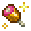

---
navigation:
  title: Culinary
  icon: farmersdelight:cooking_pot
item_ids:
  - farmersdelight:cooking_pot
  - farmersdelight:skillet
---
# <Color id="blue">Culinary</Color>

# <Color id="blue">Culinary System</Color>

Cooking is a relaxing activity, but it is also a beneficial activity for the player. More elaborate foods tend to offer a greater amount of saturation, in addition to being able to offer side effects such as **Comfort** or **Nourishment**.

There are different types of dishes with different purposes, but before introducing you to them, here is a brief explanation of the added workstations.

# <Color id="blue">Workstations</Color>

<BlockImage id="farmersdelight:cooking_pot" scale="3" />

## <Color id="yellow">Cooking Pot</Color>

The <ItemLink id="farmersdelight:cooking_pot" /> is necessary to cook some recipes.

It needs to be heated by a heat source such as a <ItemLink id="minecraft:magma_block" /> or <ItemLink id="farmersdelight:stove" /> and has a simple interface.

- 6 slots for possible ingredients
- 1 slot dedicated to a container
- 1 output slot

The Cooking Pot takes 10 seconds to cook each recipe and can generate experience depending on the recipe.

- You can carry the <ItemLink id="farmersdelight:cooking_pot" /> with items inside in your inventory

<BlockImage id="farmersdelight:skillet" scale="3" />

## <Color id="yellow">Skillet</Color>

The <ItemLink id="farmersdelight:skillet" /> works like a <ItemLink id="minecraft:campfire" />, but can store up to 64 items, frying one at a time. Interestingly, it can be used as a weapon, having 8 damage.

It needs to be heated by a heat source such as a <ItemLink id="minecraft:magma_block" /> or <ItemLink id="farmersdelight:stove" /> and does not have an interface.

When an ingredient is fried, the skillet drops it upwards, thus being able to be collected with blocks like the <ItemLink id="create:andesite_funnel" />.

The <ItemLink id="farmersdelight:skillet" /> takes 6 seconds to fry each recipe, but this time can be reduced if it is enchanted with **Fire Aspect**.

# <Color id="blue">Types of dishes</Color>
As mentioned above, the mod introduces new dishes which are divided into types.

Below is a brief summary of the types, presenting 3 dishes of each.

## <Color id="yellow">Finger Foods</Color>
Small portion foods.
- <ItemLink id="farmersdelight:barbecue_stick" />
- <ItemLink id="farmersdelight:egg_sandwich" />
- <ItemLink id="farmersdelight:dumplings" />

## <Color id="yellow">Meals</Color>
Consists of salads, broths, and plated meals.
- <ItemLink id="farmersdelight:mixed_salad" />
- <ItemLink id="farmersdelight:pasta_with_meatballs" />
- <ItemLink id="farmersdelight:beef_stew" />

## <Color id="yellow">Feasts</Color>
Heavy foods that need to be placed before being eaten, like a cake.
- <ItemLink id="farmersdelight:honey_glazed_ham" />
- <ItemLink id="farmersdelight:stuffed_pumpkin" />
- <ItemLink id="farmersdelight:rice_roll_medley_block" />

## <Color id="yellow">Sweets</Color>
Consists of sweet foods like pies, cakes, and cookies.
- <ItemLink id="farmersdelight:apple_pie" />
- <ItemLink id="farmersdelight:cake_slice" />
- <ItemLink id="farmersdelight:chocolate_pie" />

## <Color id="yellow">Drinks</Color>
These are drinks that do not restore hunger but give you benefits.
- <ItemLink id="farmersdelight:hot_cocoa" />
- <ItemLink id="farmersdelight:apple_cider" />
- <ItemLink id="farmersdelight:melon_juice" />

## <Color id="yellow">Pet Foods</Color>
Special foods, made for animals that give them some benefits.
- <ItemLink id="farmersdelight:dog_food" />
- <ItemLink id="farmersdelight:horse_feed" />

# <Color id="blue">Effects</Color>

##  <Color id="yellow">Nourishment</Color>
The **Nourishment** effect prevents players from losing hunger or saturation when performing exhausting actions like running, jumping, and attacking mobs. This effectively extends your hunger bar beyond its saturation limit, allowing you to go longer before needing to eat again.

- When consuming meals served on plates, players gain the Nourishment effect for a varying amount of time. Furthermore, Nourishment **fully negates the Hunger effect**.

##  <Color id="yellow">Comfort</Color>
The **Comfort** effect enables players to maintain natural health regeneration even when their hunger level would normally prevent it. This beneficial effect is visually indicated by a **silver sheen** that scrolls over your health meter.

- Players receive the Comfort effect for a varying duration when consuming meals served in **bowls**.

# <Color id="blue">Other Chapters</Color>
<SubPages />