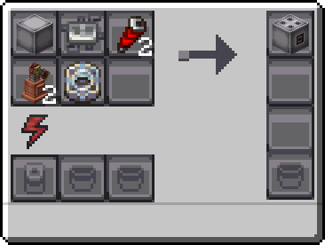

---
navigation:
  icon: techpack:basic_combustion_engine
  title: Combustion Engine
  parent: electric_machines/index.md
categories:
  - electrical_machines
  - basic_machines
  - require/basic_circuit
  - require/redstone_coils
item_ids:
  - techpack:basic_combustion_engine
---
# Electrical Machine

<Row>
<ItemImage id="techpack:basic_combustion_engine"/>

# <Color id="blue">Combustion Engine</Color>
</Row>
An internal combustion engine burns a mixture of air and fuel in a closed chamber to generate an expansion of gases that pushes a piston, generating energy.

* requires electrical energy to operate.

## <Color id="yellow">Recipe</Color>

### <Color id="light_purple"># Basic Assembler</Color>

## <Color id="yellow">Required Technology</Color>
* <ItemLink id="techpack:basic_assembler"/> - Basic Tier

## <Color id="yellow">Tier Upgrade</Color>
Electrical machines have tiers like Mekanism or Gregtech

<Color id="red">Basic</Color> > <Color id="blue">Advanced</Color> > <Color id="green">Sophisticated</Color> 

Tier Changes:
* Increase Energy Storage
* Increase Processing Speed 
* Exclusive Tier Recipes 

<Color id="green">⚠ Tip:</Color> For recipes that require specific tiers, information is added to the JEI/EMI