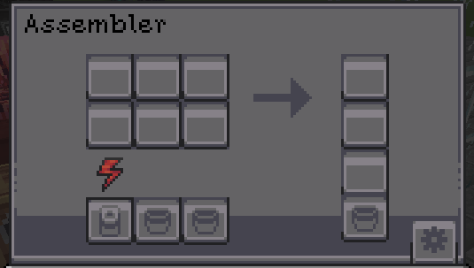

# Techlab Machines

<GameScene zoom="3">
  <ImportStructure src="../assets/game_scenes/techpack_machines.nbt" />
</GameScene>

# <Color id="blue">What is TechPack machines?</Color>
Techpack has a local library specially made for this experience, it has items, blocks and machines, 
* the machine has unique features among them.

## <Color id="yellow">Machines</Color>
All the machines added by techpack:
<SubPages />

# <Color id="blue">Patterns between machines</Color>
techpack machines have certain notable patterns, they are

## <Color id="yellow">Energy Bar</Color>
For machines that require or produce energy there is a bar that indicates energy storage

## <Color id="yellow">Import and Export Config</Color>
You can configure it by clicking the button with the gear icon (located in the right corner).

Once pressed, it will add a colored square above the machine's elements. By clicking on an element, you can configure which face can be set to input, output, or both:

* <Color id="red">Red = Import</Color>
* <Color id="blue"> Blue = Export </Color>
* <Color id="light_purple"> Purple = Both </Color>

The rectangular buttons below indicate whether auto-import/export is enabled (Auto-import/export is a function that automatically pulls or pushes items, fluids, and energy without the need for external mechanisms).

## <Color id="yellow">Tier Upgrade</Color>
Electrical machines have tiers like Mekanism or Gregtech

Basic > Advanced > Sophisticated 

Tier Changes:
* Increase Energy Storage
* Increase Processing Speed 
* Exclusive Tier Recipes 

<Color id="green">⚠ Tip:</Color> For recipes that require specific tiers, information is added to the JEI/EMI