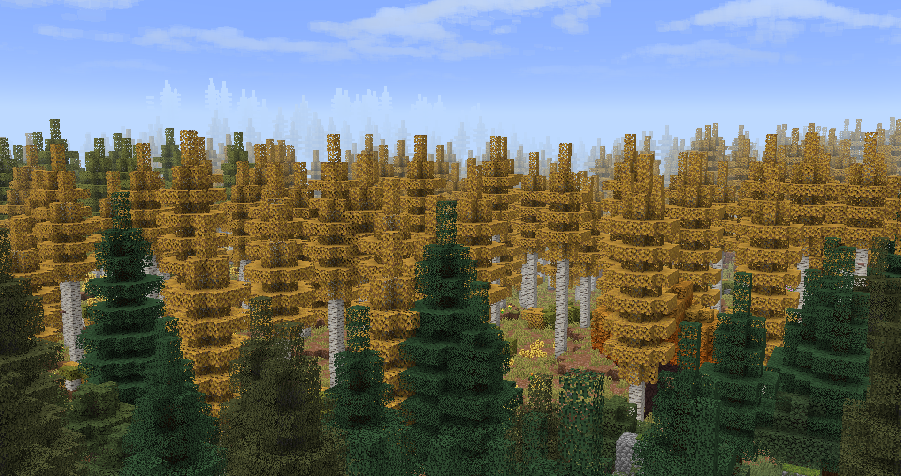
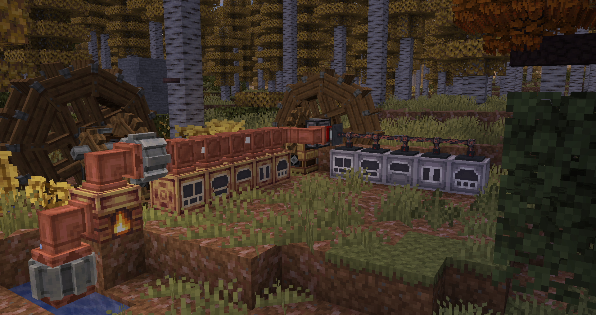
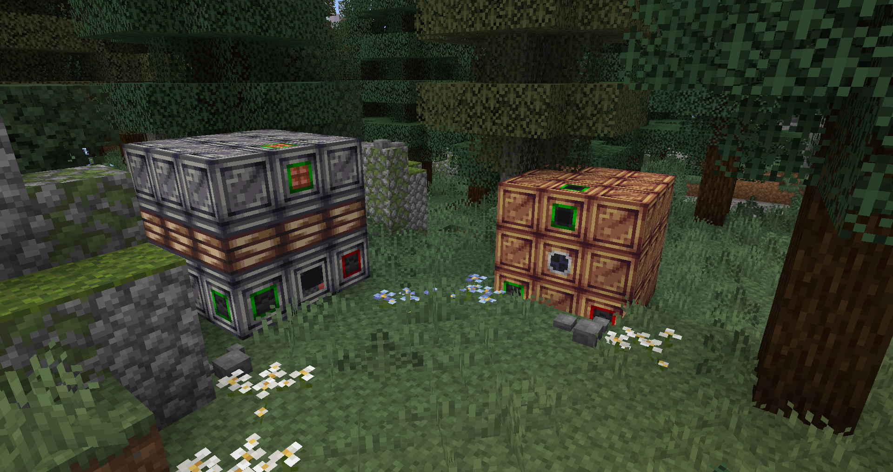

---
navigation:
  icon: ae2:controller
  title: The TechPack
  position: 1
---

# The TechPack

## <Color id="red">⚠ Alpha Testing</Color>
<Color id="red">The modpack is in alpha, its content is not complete and bugs are expected, please report them on the Discord server below.</Color>

# <Color id="blue">Welcome to Techpack!</Color>
TechPack is a modpack for inspired by classics like E2E, E2EE, and GTNH, which seeks to combine concepts of magic, technology, and base management. TechPack alters player progression, guiding you through quests and additional information on **_Moddedpedia_** (in-game wiki), adding new steps and obstacles.

The modpack features meticulous aesthetic care, which is refined daily, blending the avant-garde of the golden age with the modernity introduced after Village and Pillage (1.14).

The most notable additions are the new machines added exclusively to the experience; they are heavily inspired by one of the pioneering automation mods, Industrial Craft, along with its older addon, later a separate mod GregTech 5.

Another of its notable features is multi-blocks, which can facilitate the processing of large quantities of items or unlock resources for your advancement.

# <Color id="blue">About</Color>
* Join our community, report bugs, and submit suggestions on our [Discord server](https://discord.gg/KSsHCn3eww).
* [My Social Media](https://linktr.ee/bl4ck_)