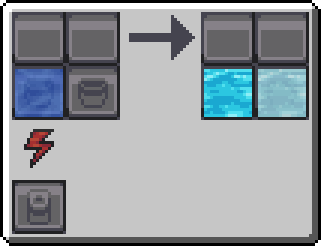
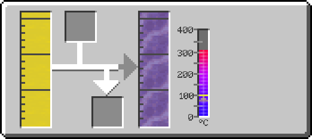
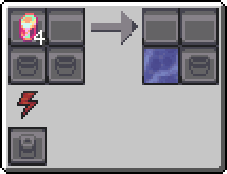
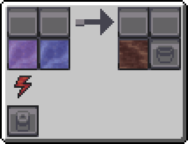
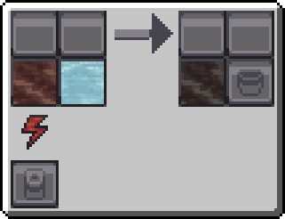
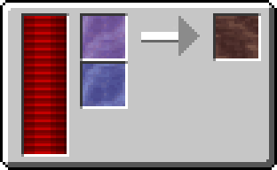
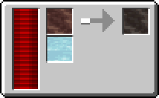

---
navigation:
  icon: techpack:polytetrafluoroethylene_bucket
  title: Polytetrafluoroethylene Line
  parent: processing_lines/index.md
categories:
  - processing_lines
  - require/solidifier
  - require/reaction_chamber
  - require/large_reaction_chamber
  - require/electrolysis_separator
  - require/thermo_pneumatic_processing_plant
item_ids:
  - techpack:polytetrafluoroethylene_bucket
  - techpack:tetrafluoroethylene_bucket
---
# Synthetic Material

<Row>
<ItemImage id="techpack:polytetrafluoroethylene_bucket"/>

# <Color id="blue">Polytetrafluoroethylene Line</Color>
</Row>
It is a synthetic polymer, popularly known by the brand Teflon™, famous for its non-stick properties, low friction, and high chemical and thermal resistance.

# <Color id="blue">Main Line Steps</Color>

## <Color id="light_purple"># Electrolysis Separator</Color>

### Costs
* 2 mB of Water
* 200 RF (1 RF/t)
* 10s Processing Time
### Results
* 2 mB of Hydrogen
* 1 mB of Oxygem
---

## <Color id="light_purple"># Thermopneumatic Processing Plant</Color>

### Costs
* 5 mB of LPG
* Temperature >= 100°C
### Results
* 5 mB of Ethylene
---

## <Color id="light_purple"># Electrolysis Separator</Color>

### Costs
* 4x Large Strange Crystal
* 400 RF (2 RF/t)
* 10s Processing Time
### Results
* 500 mB of Fluorine
---

## <Color id="light_purple"># Reaction Chamber</Color>

### Costs
* 200 mB of Ethyline
* 400 mB of Fluorine
* 300 RF (1 RF/t)
* 15s Processing Time
### Results
* 600 mB of Tetrafluoroethylene
---

## <Color id="light_purple"># Reaction Chamber</Color>

### Costs
* 800 mB of Tetrafluoroethylene
* 700 mB of Oxygen
* 1.200 RF (2 RF/t)
* 30 Processing Time
### Results
* 1.500 mB of Tetrafluoroethylene
---

## <Color id="yellow">Main Line Required Technology</Color>
* <ItemLink id="techpack:basic_reaction_chamber"/>
* <ItemLink id="techpack:basic_electrolysis_separator"/>
* Thermopneumatic Processing Plant

# <Color id="blue">Alternative Line Steps</Color>

## <Color id="light_purple"># Electrolysis Separator</Color>

### Costs
* 2 mB of Water
* 200 RF (1 RF/t)
* 10s Processing Time
### Results
* 2 mB of Hydrogen
* 1 mB of Oxygem
---

## <Color id="light_purple"># Thermopneumatic Processing Plant</Color>

### Costs
* 5 mB of LPG
* Temperature >= 100°C
### Results
* 5 mB of Ethylene
---

## <Color id="light_purple"># Electrolysis Separator</Color>

### Costs
* 4x Large Strange Crystal
* 400 RF (2 RF/t)
* 10s Processing Time
### Results
* 500 mB of Fluorine
---

## <Color id="light_purple"># Large Reaction Chamber</Color>

### Costs
* 2000 mB of Ethyline
* 4000 mB of Fluorine
* 3.000 RF (5 RF/t)
* 15s Processing Time
### Results
* 600 mB of Tetrafluoroethylene
---

## <Color id="light_purple"># Large Reaction Chamber</Color>

### Costs
* 8000 mB of Tetrafluoroethylene
* 7000 mB of Oxygen
* 1.500 RF (5 RF/t)
* 30 Processing Time
### Results
* 15.000 mB of Tetrafluoroethylene
---

## <Color id="yellow">Alternative Line Required Technology</Color>
* <ItemLink id="techpack:basic_electrolysis_separator"/>
* Thermopneumatic Processing Plant
* Large Reaction Chamber