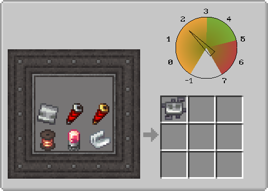

---
navigation:
  icon: techpack:basic_circuit
  title: Basic Circuit
  parent: resource_and_materials/index.md
categories:
  - synthetic
  - require/pressure_chamber
  - require/coils
  - require/basic_circuit_board
  - require/electron_tube
  - require/electrical_insulator
  - require/redstone_coils
item_ids:
  - techpack:basic_circuit
---
# Synthetic Material

<ItemImage id="techpack:basic_circuit"/>

# <Color id="blue">Basic Circuit</Color>
A basic electrical circuit with simple operation, yet very efficient for machine manufacturing.

## <Color id="yellow">Recipe</Color>
<Recipe id="techpack:minecraft/shaped/techpack/basic_circuit" />

---

### <Color id="light_purple"># Pressure Chamber</Color>

### Costs
* 1x <ItemLink id="techpack:basic_circuit_board"/>
* 1x <ItemLink id="techpack:redstone_transmission_coil"/>
* 1x <ItemLink id="techpack:redstone_reception_coil"/>
* 1x <ItemLink id="createaddition:copper_spool"/>
* 1x <ItemLink id="create:electron_tube"/>
* 1x any electrical insulator
### Results
* 1x <ItemLink id="techpack:basic_circuit"/>

## <Color id="yellow">Required Technology</Color>
* Pressure Chamber

## <Color id="yellow">Uses</Color>
<CategoryIndex category="require/basic_circuit" />