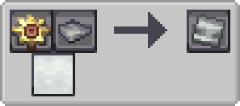
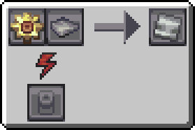

---
navigation:
  icon: techpack:basic_circuit_board
  title: Basic Circuit Board
  parent: resource_and_materials/index.md
categories:
  - synthetic
  - require/steel
  - require/electrum
  - require/bearing
item_ids:
  - techpack:basic_circuit_board
---
# Synthetic Material

<ItemImage id="techpack:basic_circuit_board"/>

# <Color id="blue">Basic Circuit Board</Color>
A steel plate with an electrum gear that serves as a coating for <ItemLink id="techpack:basic_circuit"/>

## <Color id="yellow">Recipe</Color>
### <Color id="light_purple"># Steam Compressor</Color>

### Costs
* 15s Processing time
* 1200 mB of Steam (4 mB/t)
### Results
* 1x <ItemLink id="techpack:basic_circuit_board"/>

---

### <Color id="light_purple"># Basic Compressor</Color>

### Costs
* 10s Processing time
* 800 RF (4 RF/t)
### Results
* 1x <ItemLink id="techpack:basic_circuit_board"/>

## <Color id="yellow">Required Technology</Color>
* Steam Machines

## <Color id="yellow">Uses</Color>
<CategoryIndex category="require/basic_circuit_board" />