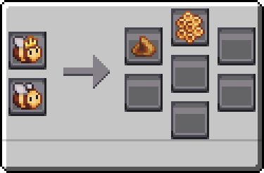

---
navigation:
  icon: techpack:beewax
  title: Beewax
  parent: resource_and_materials/index.md
categories:
  - natural
  - require/apiary
item_ids:
  - techpack:beewax
---
# Natural Resource

<Row>
<ItemImage id="techpack:beewax"/>

# <Color id="blue">Beewax</Color>
</Row>
Beeswax is a natural wax produced by bees, obtained as a byproduct of comb production. It is widely used for polishing and waterproofing.

## <Color id="yellow">Recipe</Color>

### <Color id="light_purple"># Apiary</Color>

### Costs
* Any Drone
* Any Queen
* Requirements relating to the bee species

### Results
* 1x Honeycomb related to bee species (75% Chance)
* 1x <ItemLink id="techpack:beewax"/>

## <Color id="yellow">Uses</Color>
<CategoryIndex category="require/beewax" />