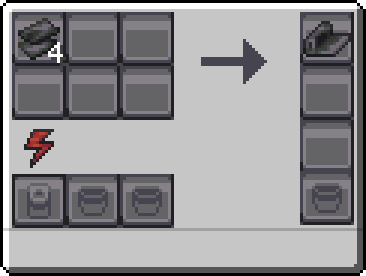

---
navigation:
  icon: techpack:carbon_fiber
  title: Carbon Fiber
  parent: resource_and_materials/index.md
categories:
  - synthetic
  - require/assembler
  - require/carbon_mesh
item_ids:
  - techpack:carbon_fiber
---
# Synthetic Material

<Row>
<ItemImage id="techpack:carbon_fiber"/>

# <Color id="blue">Carbon Fiber</Color>
</Row>
Carbon fiber is a material composed of extremely thin carbon meshes, which is incredibly strong and lightweight at the same time.

## <Color id="yellow">Recipe</Color>

### <Color id="light_purple"># Basic Assembler</Color>

### Costs
* 4x <ItemLink id="techpack:carbon_fiber" />
* 10s Processing time
* 400 RF (2 RF/t)
### Results
* 1x <ItemLink id="techpack:carbon_fiber"/>

## <Color id="yellow">Required Technology</Color>
* <ItemLink id="techpack:basic_assembler"/>

## <Color id="yellow">Uses</Color>
<CategoryIndex category="require/carbon_fiber" />