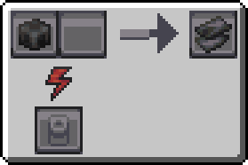

---
navigation:
  icon: techpack:carbon_mesh
  title: Carbon Mesh
  parent: resource_and_materials/index.md
categories:
  - synthetic
  - require/metal_former
  - require/graphite
item_ids:
  - techpack:carbon_mesh
---
# Synthetic Material

<Row>
<ItemImage id="techpack:carbon_mesh"/>

# <Color id="blue">Carbon mesh</Color>
</Row>
A sheet obtained from a process of pressing and cutting graphite

## <Color id="yellow">Recipe</Color>

### <Color id="light_purple"># Basic Metal Former</Color>

### Costs
* 1x <ItemLink id="techpack:graphite_ingot" />
* 10s Processing time
* 400 RF (2 RF/t)
### Results
* 1x <ItemLink id="techpack:carbon_mesh"/>

## <Color id="yellow">Required Technology</Color>
* <ItemLink id="techpack:basic_metal_former"/>

## <Color id="yellow">Uses</Color>
<CategoryIndex category="require/carbon_mesh" />