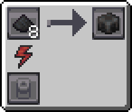

---
navigation:
  icon: techpack:graphite_ingot
  title: Graphite Ingot
  parent: resource_and_materials/index.md
categories:
  - synthetic
  - require/compressor
item_ids:
  - techpack:graphite_ingot
---
# Synthetic Material

<Row>
<ItemImage id="techpack:graphite_ingot"/>

# <Color id="blue">Graphite Ingot</Color>
</Row>
Graphite Ingot is a form of pure carbon, a soft black mineral. It functions as solid fuel, burning up to 64 items.

## <Color id="yellow">Recipe</Color>

### <Color id="light_purple"># Basic Compressor</Color>

### Costs
* 8x <ItemLink id="enderio:powdered_coal" />
* 20s Processing time
* 2.000 RF (5 RF/t)
### Results
* 1x <ItemLink id="techpack:graphite_ingot"/>

## <Color id="yellow">Required Technology</Color>
* <ItemLink id="techpack:basic_compressor"/>

## <Color id="yellow">Uses</Color>
<CategoryIndex category="require/graphite" />