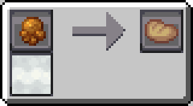
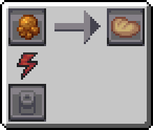
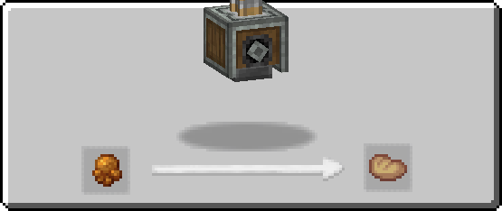
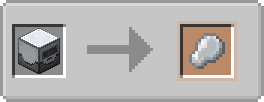

---
navigation:
  icon: techpack:latex
  title: Latex
  parent: resource_and_materials/index.md
categories:
  - natural
  - require/mechanical_press
  - require/compressor
item_ids:
  - industrialforegoing:dryrubber
  - techpack:latex
---
# Natural Resource

<Row>
<ItemImage id="techpack:latex"/>

# <Color id="blue">Latex</Color>
</Row>
<ItemLink id="techpack:latex"/> is a compound naturally produced by certain plants. It can be obtained from pressing <ItemLink id="nomansland:resin"/> or extracted as a fluid using an <ItemLink id="industrialforegoing:fluid_extractor"/>.

* <ItemLink id="techpack:latex"/> and <ItemLink id="industrialforegoing:dryrubber"/> have the same uses, but are obtained in different ways.

## <Color id="yellow">Recipe</Color>
<Recipe id="techpack:minecraft/shapeless/techpack/latex_manual_only" />

### <Color id="light_purple"># Steam Compressor</Color>

### Costs
* 1x <ItemLink id="nomansland:resin"/>
* 10s Processing time
* 200 mB of Steam (1 mB/t)
### Results
* 1x <ItemLink id="techpack:latex"/>

---

### <Color id="light_purple"># Basic Compressor</Color>

### Costs
* 1x <ItemLink id="nomansland:resin"/>
* 5s Processing time
* 100 RF (1 RF/t)
### Results
* 1x <ItemLink id="techpack:latex"/>

---

### <Color id="light_purple"># Mechanical Press</Color>

### Costs
* 1x <ItemLink id="nomansland:resin"/>
### Results
* 1x <ItemLink id="techpack:latex"/>

---

### <Color id="light_purple"># Latex Processing unit</Color>

## <Color id="yellow">Required Technology</Color>
* None - Latex
* <ItemLink id="industrialforegoing:latex_processing_unit"/> - Dry Rubber

## <Color id="yellow">Uses</Color>
<CategoryIndex category="require/latex" />