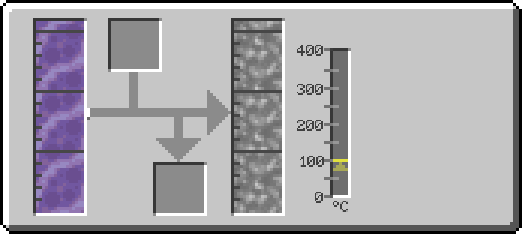
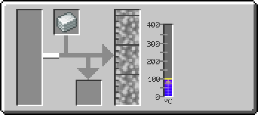
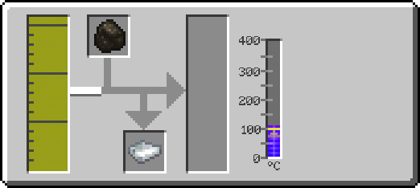
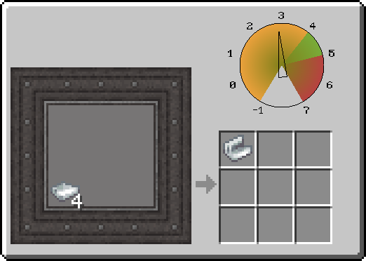
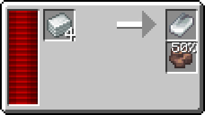
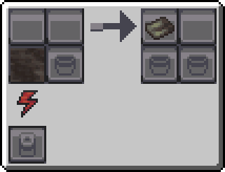

---
navigation:
  icon: pneumaticcraft:plastic
  title: Plastics
  parent: resource_and_materials/index.md
categories:
  - synthetic
  - require/solidifier
  - require/thermo_pneumatic_processing_plant
  - require/biodiesel
  - require/charcoal
  - require/pressure_chamber
  - require/arc_furnace
item_ids:
  - pneumaticcraft:plastic
  - techpack:bio_plastic_sheet
  - techpack:bio_plastic_mesh
  - techpack:ptfe_sheet
  - techpack:hdpe_sheet
---
# Synthetic Material

# <Color id="blue">Plastics</Color>
Plastics are flexible synthetic materials, formed by long chains of organic polymers (usually derived from petroleum), which can be easily molded under heat and pressure.

# <Color id="blue">Plastic Types</Color>
* **Plastic Sheet**: A petroleum byproduct, made from ethylene, a product of LPG - Most basic and cheapest variant.
* **Bio-Plastic Mesh**: Made from joining sheets of bio-plastic, which in turn is made from joining charcoal with biodiesel - Cheap variant.
* **HDPE Sheet**: A reinforced plastic sheet.
* **PTFE Sheet**: An improved version of ethylene plastic, adding flourine to the composition.

## <Color id="yellow">Uses</Color>
<CategoryIndex category="require/plastics" />
<CategoryIndex category="require/electrical_insulator" />

<Row>
<ItemImage id="pneumaticcraft:plastic"/>

# <Color id="blue">Plastic Sheet (Ethylene)</Color>
</Row>

### <Color id="yellow">Recipe</Color>

### <Color id="light_purple"># Thermopneumatic Processing Plant</Color>

### Costs
* 250 mB of Ethylene
* temperature >= 100°C
### Resuls
* 250mb Molten Plastic

---

### <Color id="light_purple"># Thermopneumatic Processing Plant</Color>

### Costs
* 1x <ItemLink id="pneumaticcraft:plastic"/>
* temperature >= 100°C
### Results
* 1.000 mB of Molten Plastic

<Row>
<ItemImage id="techpack:bio_plastic_mesh"/>

# <Color id="blue">Bio-Plastic Mesh</Color>
</Row>

### <Color id="light_purple"># Thermopneumatic Processing Plant</Color>
### <Color id="yellow">Recipe</Color>

### Costs
* 1x <ItemLink id="minecraft:charcoal"/>
* 250 mB of Biodiesel
* temperature >= 100°C
### Results
* 1x <ItemLink id="techpack:bio_plastic_sheet"/>

### <Color id="light_purple"># Pressure Chamber</Color>

### Costs
* 4x <ItemLink id="techpack:bio_plastic_sheet"/>
* Pressure 4.0 bar
### Results
* 1x <ItemLink id="techpack:bio_plastic_mesh"/>

<Row>
<ItemImage id="techpack:hdpe_sheet"/>

# <Color id="blue">HDPE Sheet</Color>
</Row>

### <Color id="yellow">Recipe</Color>

### <Color id="light_purple"># Arc Furnace</Color>

### Costs
* 4x <ItemLink id="pneumaticcraft:plastic"/>
* 6.000 RF (20 RF/t)
* 15s Processing Time
### Results
* 1x <ItemLink id="techpack:hdpe_sheet"/>

<Row>
<ItemImage id="techpack:ptfe_sheet"/>

# <Color id="blue">PTFE Sheet</Color>
</Row>

* See [Polytetrafluoroethylene Line](../processing_lines/polytetrafluoroethylene.md)

### <Color id="yellow">Recipe</Color>

### <Color id="light_purple"># Basic Solidifier</Color>

### Costs
* 1.000 mB of Polytetrafluoroethylene
* 2.000 RF (10 RF/t)
* 15s Processing Time
### Results
* 1x <ItemLink id="techpack:ptfe_sheet"/>