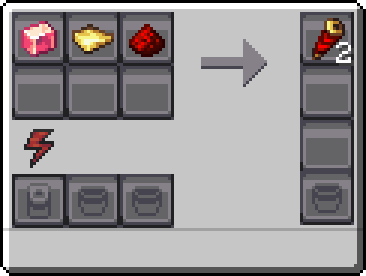
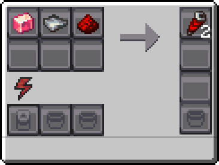
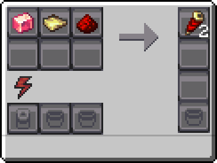
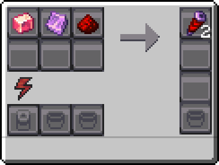

---
navigation:
  icon: techpack:redstone_reception_coil
  title: Redstone Coils
  parent: resource_and_materials/index.md
categories:
  - synthetic
  - require/assembler
item_ids:
  - techpack:redstone_reception_coil
  - techpack:redstone_transmission_coil
  - techpack:redstone_conductance_coil
  - techpack:redstone_spiritual_coil
---
# Synthetic Material

# <Color id="blue">Redstone Coils</Color>
Redstone coils control the flow of RF (Redstone Flux). Each type of coil has its own properties and uses.

## <Color id="yellow">Uses</Color>
<CategoryIndex category="require/redstone_coils" />

<Row>
<ItemImage id="techpack:redstone_reception_coil"/>

# <Color id="blue">Redstone Reception Coil</Color>
</Row>
A coil specialized in receiving energy. Commonly used in processing machines.

## <Color id="yellow">Recipe</Color>
<Recipe id="techpack:minecraft/shaped/techpack/redstone_reception_coil" />

### <Color id="light_purple"># Basic Assembler</Color>

### Costs
* 1x <ItemLink id="create:polished_rose_quartz" />
* 1x Gold Plate
* 1x <ItemLink id="minecraft:redstone" />
* 10s Processing time
* 200 RF (1 RF/t)
### Results
* 2x <ItemLink id="techpack:redstone_reception_coil"/>

---

<Row>
<ItemImage id="techpack:redstone_transmission_coil"/>

# <Color id="blue">Redstone Transmission Coil</Color>
</Row>
A coil specialized in transmit energy. Commonly used in generators.

## <Color id="yellow">Recipe</Color>
<Recipe id="techpack:minecraft/shaped/techpack/redstone_transmission_coil" />

### <Color id="light_purple"># Basic Assembler</Color>

### Costs
* 1x <ItemLink id="create:polished_rose_quartz" />
* 1x Silver Plate
* 1x <ItemLink id="minecraft:redstone" />
* 10s Processing time
* 200 RF (1 RF/t)
### Results
* 2x <ItemLink id="techpack:redstone_transmission_coil"/>

---

<Row>
<ItemImage id="techpack:redstone_conductance_coil"/>

# <Color id="blue">Redstone Conductance Coil</Color>
</Row>
A coil specialized in transmit and recive energy simultaneously. Commonly used in devices and batteries.

## <Color id="yellow">Recipe</Color>
<Recipe id="techpack:minecraft/shaped/techpack/redstone_conductance_coil" />

### <Color id="light_purple"># Basic Assembler</Color>

### Costs
* 1x <ItemLink id="create:polished_rose_quartz" />
* 1x Electrum Plate
* 1x <ItemLink id="minecraft:redstone" />
* 10s Processing time
* 200 RF (1 RF/t)
### Results
* 2x <ItemLink id="techpack:redstone_conductance_coil"/>

---

<Row>
<ItemImage id="techpack:redstone_spiritual_coil"/>

# <Color id="blue">Redstone Spiritual Coil</Color>
</Row>
A coil specialized in conducting electricity and spiritual energy, converting them depending on the need. widely used in machines and generators in relation to magic.

## <Color id="yellow">Recipe</Color>
<Recipe id="techpack:minecraft/shaped/techpack/redstone_spiritual_coil" />

### <Color id="light_purple"># Basic Assembler</Color>

### Costs
* 1x <ItemLink id="create:polished_rose_quartz" />
* 1x <ItemLink id="malum:soul_stained_steel_plating" />
* 1x <ItemLink id="minecraft:redstone" />
* 10s Processing time
* 200 RF (1 RF/t)
### Results
* 2x <ItemLink id="techpack:redstone_spiritual_coil"/>