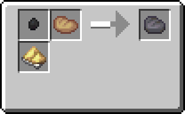
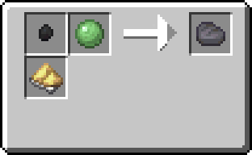
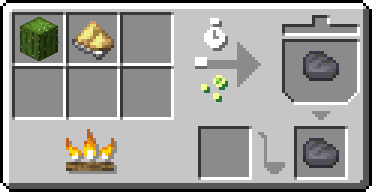
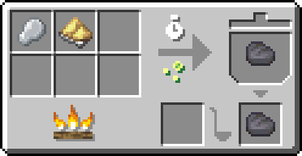
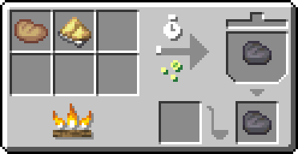
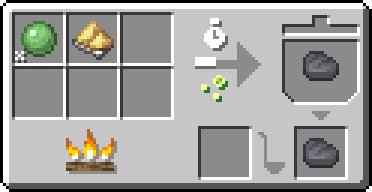
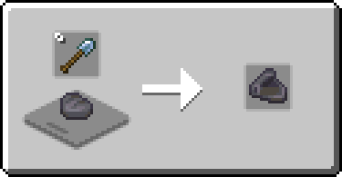
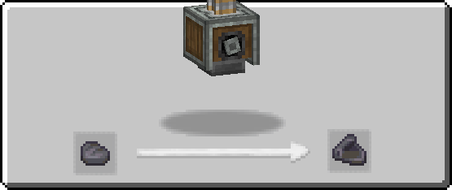

---
navigation:
  icon: techpack:rubber
  title: Rubber
  parent: resource_and_materials/index.md
categories:
  - synthetic
  - require/latex
  - require/sulfur
  - require/dry_rubber
  - require/cactus
  - require/slime
  - require/rustic_oven
  - require/cooking_pot
item_ids:
  - techpack:rubber
  - techpack:rubber_sheet
---
# Synthetic Material

<Row>
<ItemImage id="techpack:rubber"/>

# <Color id="blue">Rubber</Color>
</Row>
Rubber is a highly elastic polymer that can be natural or synthetic and is known for its ability to be stretched and return to its original shape.

## <Color id="yellow">Recipe</Color>

### <Color id="light_purple"># Rustic Oven</Color>

### Costs
* 1x <ItemLink id="techpack:latex"/>
* 1x <ItemLink id="techpack:sulfur_dust"/>
* 1x any tiny coal type
* 20s Processing time
### Results
* 1x <ItemLink id="techpack:rubber"/>
---
### <Color id="light_purple"># Rustic Oven</Color>

### Costs
* 1x <ItemLink id="minecraft:slime_ball"/>
* 1x <ItemLink id="techpack:sulfur_dust"/>
* 1x any tiny coal type
* 20s Processing time
### Results
* 1x <ItemLink id="techpack:rubber"/>
---
### <Color id="light_purple"># Cooking Pot</Color>

### Costs
* 1x <ItemLink id="minecraft:cactus"/>
* 1x <ItemLink id="techpack:sulfur_dust"/>
* 10s Processing time
### Results
* 1x <ItemLink id="techpack:rubber"/>
---
### <Color id="light_purple"># Cooking Pot</Color>

### Costs
* 1x <ItemLink id="industrialforegoing:dryrubber"/>
* 1x <ItemLink id="techpack:sulfur_dust"/>
* 10s Processing time
### Results
* 1x <ItemLink id="techpack:rubber"/>
---
### <Color id="light_purple"># Cooking Pot</Color>

### Costs
* 1x <ItemLink id="techpack:latex"/>
* 1x <ItemLink id="techpack:sulfur_dust"/>
* 10s Processing time
### Results
* 1x <ItemLink id="techpack:rubber"/>
---
### <Color id="light_purple"># Cooking Pot</Color>

### Costs
* 1x <ItemLink id="minecraft:slime_ball"/>
* 1x <ItemLink id="techpack:sulfur_dust"/>
* 10s Processing time
### Results
* 1x <ItemLink id="techpack:rubber"/>
---

<Row>
<ItemImage id="techpack:rubber_sheet"/>

# <Color id="blue">Rubber Sheet</Color>
</Row>
Essentially, it's pressed rubber, used to insulate electrical components. It has good resistance and is waterproof.

## <Color id="yellow">Recipe</Color>

### <Color id="light_purple"># Cutting Board</Color>

### Costs
* 1x <ItemLink id="techpack:rubber"/>
* Any Shovel
### Results
* 1x <ItemLink id="techpack:rubber_sheet"/>
---
### <Color id="light_purple"># Mechanical Press</Color>

### Costs
* 1x <ItemLink id="techpack:rubber"/>
### Results
* 1x <ItemLink id="techpack:rubber_sheet"/>
---

## <Color id="yellow">Required Technology</Color>
* Rustic Oven

## <Color id="yellow">Uses</Color>
<CategoryIndex category="require/rubber" />
<CategoryIndex category="require/electrical_insulator" />
