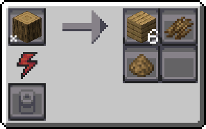

---
navigation:
  icon: techpack:sawdust
  title: Sawdust
  parent: resource_and_materials/index.md
categories:
  - natural
  - require/sawmill
item_ids:
  - techpack:sawdust
---
# Natural Resource

<Row>
<ItemImage id="techpack:sawdust"/>

# <Color id="blue">Sawdust</Color>
</Row>
Sawdust are the fine wood particles created during the process of cutting, sanding, or milling wood. It is a byproduct of log processing in <ItemLink id="techpack:basic_sawmill"/>

## <Color id="yellow">Recipe</Color>

### <Color id="light_purple"># Basic Sawmill - (Any Log)</Color>

* Has 50% to be obtained
* 1x Any Log
* 10s Processing time
* 200 RF (1 RF/t)

## <Color id="yellow">Required Technology</Color>
* <ItemLink id="techpack:basic_sawmill"/>

## <Color id="yellow">Uses</Color>
<CategoryIndex category="require/sawdust" />