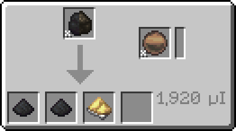
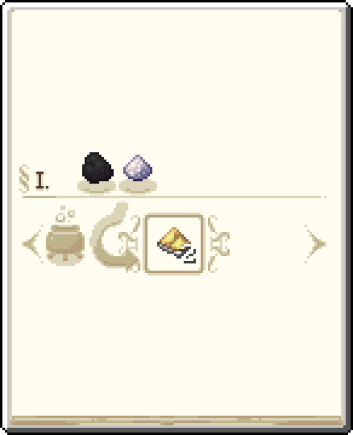

---
navigation:
  icon: techpack:sulfur_cluster
  title: Sulfur
  parent: resource_and_materials/index.md
categories:
  - natural
item_ids:
  - techpack:sulfur_cluster
  - techpack:sulfur_crystal
  - techpack:budding_sulfur
  - techpack:sulfur_dust
---
# Natural Resource

<Row>
<ItemImage id="techpack:sulfur_cluster"/>

# <Color id="blue">Sulfur Cluster</Color>
</Row>
Sulfur is a nonmetallic chemical element. Its powder is important in the manufacture of rubber, a widely used and readily available component of TechPack.

* Breaking <ItemLink id="minecraft:coal_ore"/>
* Finding Geodes Around the World

Their geodes are large and contain a large amount of sulfur. Finding one can be a great help.

<GameScene>
  <ImportStructure src="../assets/game_scenes/sulfur_geode_2.nbt" />
  <IsometricCamera yaw="145" pitch="20" />
</GameScene>

## <Color id="yellow">Processing</Color>

There are several methods for processing sulfur into dust, the most common being the grinding of its crystals and clusters, which will not be mentioned here to avoid redundancy, but here are alternative methods for producing sulfur:

### <Color id="light_purple"># Sag Mill </Color>

### Costs
* 1x <ItemLink id="minecraft:coal"/>
* 840 RF
* Any Grinding Ball
### Results
* 1x <ItemLink id="enderio:powdered_coal" />
* 1x <ItemLink id="enderio:powdered_coal" /> (10% Chance)
* 1x <ItemLink id="techpack:sulfur_dust"/> (10% Chance)

---

### <Color id="light_purple"># Crucible </Color>

### Costs
* 1x <ItemLink id="minecraft:coal"/>
* 1x <ItemLink id="eidolon_repraised:enchanted_ash"/>
### Results
* 2x <ItemLink id="techpack:sulfur_dust"/>

---

### <Color id="light_purple"># Resource Collector </Color>
### Costs
* It needs to be in some orbit.
### Results
* 1-5 <ItemLink id="techpack:sulfur_dust"/> (chance of approximately 12.5%)

## <Color id="yellow">Uses</Color>
<CategoryIndex category="require/sulfur" />